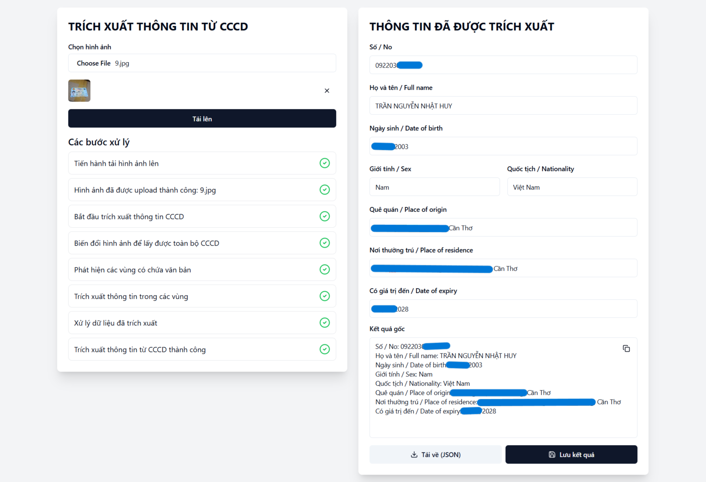

# Vietnamese ID Card Information Extractor (Client)

A project focused on extracting information from the front side of Vietnamese ID cards, such as ID number, name, and address. This client-side application is built with React, allows users to upload card images, view each step of the processing, and manage the results.

Check out [Vietnamese ID Card Information Extractor (Server)](https://github.com/bp82125/vietid-extractor-server)

## ⚠️ Warning

The UI of this project is mostly generated using [v0](https://v0.dev/), as I didn't have enough time to properly learn React for this course project. Please use with caution!

## Layout

<p align="center">
    
    
</p>

## Technologies

- Typescript
- React
- TailwindCSS
- shadcn/ui

## Getting started

### Prerequisites

- Node.js >= 20.18

### Cloning

```bash
git clone https://github.com/bp82125/vietid-extractor-client.git path/to/your/directory
```

### Project setups

```bash
cd vietid-extractor-client
npm install
```

### Setting up the environment variables

1. Rename .env.example to .env
2. Edit the .env file and update the VITE_BASE_API_ENDPOINTS with the appropriate server endpoint
```bash
VITE_BASE_API_ENDPOINTS=http://localhost:5000/api/v1
```

### Compile and Hot-Reload for Development

```bash
npm run dev
```

### Compile and Minify for Production

```sh
npm run build
```

### Lint with [ESLint](https://eslint.org/)

```sh
npm run lint
```
